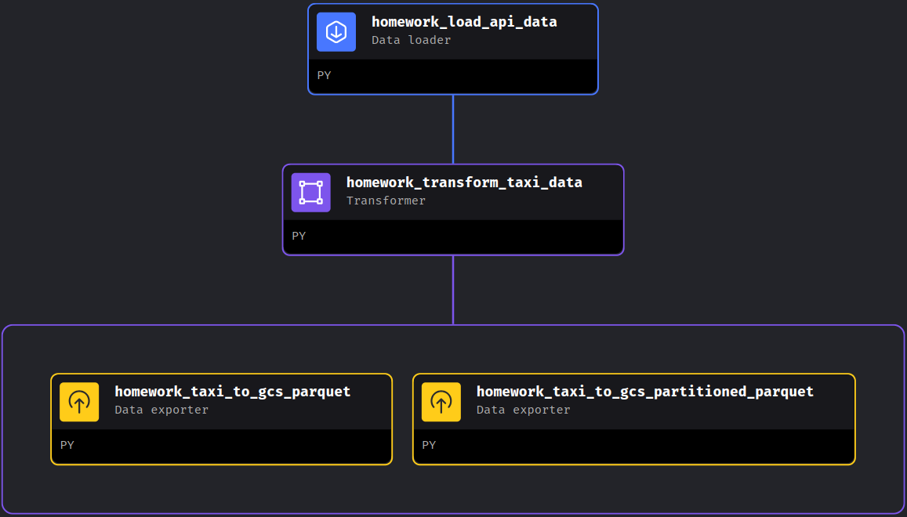

## Week 2 Homework

> In case you don't get one option exactly, select the closest one 

For the homework, we'll be working with the _green_ taxi dataset located here:

`https://github.com/DataTalksClub/nyc-tlc-data/releases/tag/green/download`

### Assignment

The goal will be to construct an ETL pipeline that loads the data, performs some transformations, and writes the data to a database (and Google Cloud!).

1) Create a new pipeline, call it `green_taxi_etl`

2) Add a data loader block and use Pandas to read data for the final quarter of 2020 (months `10`, `11`, `12`).
  - You can use the same datatypes and date parsing methods shown in the course.
  - `BONUS`: load the final three months using a for loop and `pd.concat`
```python
# changing dtypes   
taxi_dtypes = {
    'VendorID': pd.Int64Dtype(),
    'passenger_count': pd.Int64Dtype(),
    'trip_distance': float,
    'RatecodeID':pd.Int64Dtype(),
    'store_and_fwd_flag':str,
    'PULocationID':pd.Int64Dtype(),
    'DOLocationID':pd.Int64Dtype(),
    'payment_type': pd.Int64Dtype(),
    'fare_amount': float,
    'extra':float,
    'mta_tax':float,
    'tip_amount':float,
    'tolls_amount':float,
    'improvement_surcharge':float,
    'total_amount':float,
    'congestion_surcharge':float
}
# native date parsing (this lets pandas know you are parsing dates and it'll handle it automatically)
parse_dates = ['lpep_pickup_datetime', 'lpep_dropoff_datetime']   
@data_loader
# function to load urls for green taxi data in Q4 of 2020
def load_data_from_api(*args, **kwargs):
    urls = [
        'https://github.com/DataTalksClub/nyc-tlc-data/releases/download/green/green_tripdata_2020-10.csv.gz',
        'https://github.com/DataTalksClub/nyc-tlc-data/releases/download/green/green_tripdata_2020-11.csv.gz',
        'https://github.com/DataTalksClub/nyc-tlc-data/releases/download/green/green_tripdata_2020-12.csv.gz'
    ]
    # for loop to read url, change dtypes, and parse dates
    dataframes = []
    for url in urls:
        df = pd.read_csv(
            url,
            sep = ',',
            compression = 'gzip',
            dtype = taxi_dtypes,
            parse_dates=parse_dates
        )
        dataframes.append(df)
    all_data = pd.concat(dataframes, ignore_index = True)
    return all_data
@test
def test_output(output, *args) -> None:
    assert output is not None, 'The output is undefined'
```
3) Add a transformer block and perform the following:
    - Remove rows where the passenger count is equal to 0 _or_ the trip distance is equal to zero.
    - Create a new column `lpep_pickup_date` by converting `lpep_pickup_datetime` to a date.
    - Rename columns in Camel Case to Snake Case, e.g. `VendorID` to `vendor_id`.
    - Add three assertions:
      - `vendor_id` is one of the existing values in the column (currently)
      - `passenger_count` is greater than 0
      - `trip_distance` is greater than 0
```python
@transformer
def camel_to_snake(name):
    """
    Convert a CamelCase name into snake_case.
    """
    s1 = re.sub('(.)([A-Z][a-z]+)', r'\1_\2', name)
    return re.sub('([a-z0-9])([A-Z])', r'\1_\2', s1).lower()

@transformer
def transform(data, *args, **kwargs):
    # Convert column names from CamelCase to snake_case
    data.columns = [camel_to_snake(column) for column in data.columns]
    # Counting rows with specific conditions
    null_vendor_id_count = data['vendor_id'].isnull().sum()
    zeros_passenger_count = data[data['passenger_count'] == 0].shape[0]
    zeros_trip_distance_count = data[data['trip_distance'] == 0].shape[0]
    print(f'rides where vendor is null: {null_vendor_id_count}')
    print(f'rides with zero passengers: {zeros_passenger_count}')
    print(f'rides with zero trip distance: {zeros_trip_distance_count}')
    # Creating date columns for pickup and dropoff dates
    data['lpep_pickup_date'] = data['lpep_pickup_datetime'].dt.date
    data['lpep_dropoff_date'] = data['lpep_dropoff_datetime'].dt.date
    # Filtering out rows with undesirable conditions
    filtered_data = data[
        (data['passenger_count'] > 0) &
        (data['trip_distance'] > 0) &
        data['vendor_id'].notnull()
    ]
    # Get unique vendors
    unique_vendors = filtered_data['vendor_id'].unique()
    print(f'Unique vendors: {unique_vendors}')
    return filtered_data
@test
def test_output(output, *args) -> None:
    null_vendor_id_count = output['vendor_id'].isnull().sum()
    zero_passenger_count = output[output['passenger_count'] == 0].shape[0]
    zero_trip_distance = output[output['trip_distance'] == 0].shape[0]
    assert null_vendor_id_count == 0, "There are rides with null vendor_id 🚕"
    assert zero_passenger_count == 0, 'There are rides with zero passengers 🚖'
    assert zero_trip_distance == 0, 'There are rides with zero trip distance 🛣️'
```
4) Using a Postgres data exporter (SQL or Python), write the dataset to a table called `green_taxi` in a schema `mage`. Replace the table if it already exists.
```python
@data_exporter
def export_data_to_postgres(df: DataFrame, **kwargs) -> None:
    schema_name = 'mage'  # Specify the name of the schema to export data to
    table_name = 'green_taxi'  # Specify the name of the table to export data to
    config_path = path.join(get_repo_path(), 'io_config.yaml')
    config_profile = 'dev'
    with Postgres.with_config(ConfigFileLoader(config_path, config_profile)) as loader:
        loader.export(
            df,
            schema_name,
            table_name,
            index=False,
            if_exists='replace'
        )
```
5) Write your data as Parquet files to a bucket in GCP, partioned by `lpep_pickup_date`. Use the `pyarrow` library!
```python
os.environ['GOOGLE_APPLICATION_CREDENTIALS'] = "/home/src/claytor-mage.json"
bucket_name = 'claytor-mage'
project_id = 'Claytor DE Bootcamp'
table_name = 'green_taxi'
root_path = f'{bucket_name}/{table_name}'
@data_exporter
def export_data(data, *args, **kwargs):
    # gives us the date as as string that pyarrow can use
  data['lpep_pickup_date']
    # reads data into a pyarrow table with pandas
  table = pa.Table.from_pandas(data)
    # find google cloud storage object which is in the pyarrow file system.  Authroizes using environment variable automatically
  gcs = pa.fs.GcsFileSystem()
  # Use parquet write to data set method to dataset.  This requires three arguents
  pq.write_to_dataset(
    #first argument is "table" which is a pyarrow table
    table,
    # second argument is "root_path"
    root_path=root_path,
    # third argument is a list "partition_cols" where the columns to partion on are indicated
    partition_cols = ['lpep_pickup_date'],
    # The last argument is the file system, which is the gcs file system
    filesystem=gcs
  )
```
6) Schedule your pipeline to run daily at 5AM UTC.
    **Done**

### Questions

## Question 1. Data Loading

Once the dataset is loaded, what's the shape of the data?

**266,855 rows x 20 columns**

## Question 2. Data Transformation

Upon filtering the dataset where the passenger count is greater than 0 _and_ the trip distance is greater than zero, how many rows are left?

**139,370 rows**

## Question 3. Data Transformation

What creates a new column `lpep_pickup_date` by converting `lpep_pickup_datetime` to a date?

```python
data['lpep_pickup_date'] = data['lpep_pickup_datetime'].dt.date
```

## Question 4. Data Transformation

What are the existing values of `VendorID` in the dataset?

**1 or 2**

## Question 5. Data Transformation

How many columns need to be renamed to snake case?

**4**

## Question 6. Data Exporting

Once exported, how many partitions (folders) are present in Google Cloud?

**96**

## Submitting the solutions

* Form for submitting: https://courses.datatalks.club/de-zoomcamp-2024/homework/hw2

Deadline: February, 5th (Monday), 23:00 CET