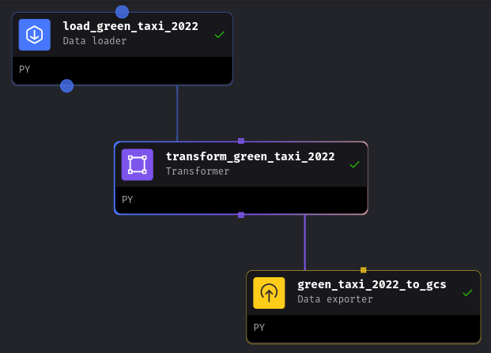

## Week 3 Homework
ATTENTION: At the end of the submission form, you will be required to include a link to your GitHub repository or other public code-hosting site. This repository should contain your code for solving the homework. If your solution includes code that is not in file format (such as SQL queries or shell commands), please include these directly in the README file of your repository.

<b><u>Important Note:</b></u> 
 For this homework we will be using the 2022 Green Taxi Trip Record Parquet Files from the New York
City Taxi Data found here:   https://www.nyc.gov/site/tlc/about/tlc-trip-record-data.page  
If you are using orchestration such as Mage, Airflow or Prefect do not load the data into Big Query using the orchestrator.  
Stop with loading the files into a bucket.   

> # I used mage for this. Here's my pipeline code.
    > ## - [Load](https://github.com/Claytor/data_talks_data_engineering_zoomcamp_2024/blob/main/03-data-warehouse/mage_data_warehouse/03-data-warehouse/data_loaders/load_green_taxi_2022.py)
> ## - [Transform](https://github.com/Claytor/data_talks_data_engineering_zoomcamp_2024/blob/main/03-data-warehouse/mage_data_warehouse/03-data-warehouse/transformers/transform_green_taxi_2022.py)
> ## - [Export](https://github.com/Claytor/data_talks_data_engineering_zoomcamp_2024/blob/main/03-data-warehouse/mage_data_warehouse/03-data-warehouse/data_exporters/green_taxi_2022_to_gcs.py)

<u>NOTE:</u> You will need to use the PARQUET option files when creating an External Table 

**SETUP**
- Create an external table using the Green Taxi Trip Records Data for 2022.
- Create a table in BQ using the Green Taxi Trip Records for 2022 
    > (do not partition or cluster this table).

## Question 1:
Question 1: What is count of records for the 2022 Green Taxi Data??
> 840,402

## Question 2:
- Write a query to count the distinct number of PULocationIDs for the entire dataset on both the tables. 
- What is the estimated amount of data that will be read when this query is executed on the External Table and the Table?

    - 0 MB for the External Table and 6.41MB for the Materialized Table
    - 18.82 MB for the External Table and 47.60 MB for the Materialized Table
    - 0 MB for the External Table and 0MB for the Materialized Table
    - 2.14 MB for the External Table and 0MB for the Materialized Table

## Question 3:
How many records have a fare_amount of 0?
- 12,488
- 128,219
- 112
- 1,622

## Question 4:
What is the best strategy to make an optimized table in Big Query if your query will always order the results by PUlocationID and filter based on lpep_pickup_datetime? (Create a new table with this strategy)
- Cluster on lpep_pickup_datetime Partition by PUlocationID
- Partition by lpep_pickup_datetime  Cluster on PUlocationID
- Partition by lpep_pickup_datetime and Partition by PUlocationID
- Cluster on by lpep_pickup_datetime and Cluster on PUlocationID

## Question 5:
Write a query to retrieve the distinct PULocationID between lpep_pickup_datetime
06/01/2022 and 06/30/2022 (inclusive) 

Use the materialized table you created earlier in your from clause and note the estimated bytes. Now change the table in the from clause to the partitioned table you created for question 4 and note the estimated bytes processed. What are these values?  

Choose the answer which most closely matches.  

- 22.82 MB for non-partitioned table and 647.87 MB for the partitioned table
- 12.82 MB for non-partitioned table and 1.12 MB for the partitioned table
- 5.63 MB for non-partitioned table and 0 MB for the partitioned table
- 10.31 MB for non-partitioned table and 10.31 MB for the partitioned table

## Question 6: 
Where is the data stored in the External Table you created?

- Big Query
- GCP Bucket
- Big Table
- Container Registry

## Question 7:
It is best practice in Big Query to always cluster your data:
- True
- False

## (Bonus: Not worth points) Question 8:
No Points: Write a `SELECT count(*)` query FROM the materialized table you created. How many bytes does it estimate will be read? Why?

 
## Submitting the solutions

* Form for submitting: https://courses.datatalks.club/de-zoomcamp-2024/homework/hw3

