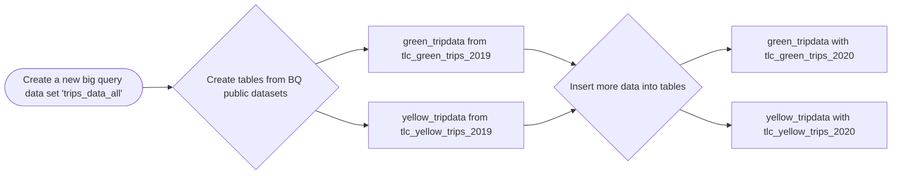
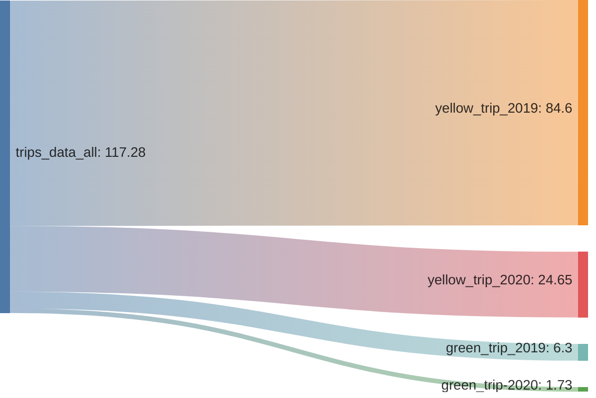

# Module 4: Analytics Engineering

## 1) Setup

### 1) Merging Datasets from public data in Big Query



#### An overview of the data (in millions)


### 2) Setting up dbt for using BigQuery (cloud)


1) create service account
1) give appropriate bq permissions
1) generate key for service account
1) create dbt account
1) make new project
1) set connection to BigQuery
1) upload key for gcp service account
1) setup repository (Git Clone from Personal Repo (ssh))
1) Add deploy key from DBT to GitHub Repo & Allow write access
1) View you Projects in DBT cloud

## 2) Defining Sources and Developing models

1) create new folder `staging` under `models` folder
1) create `schema.yml` file in `staging` folder
    1) every .yml file starts with a version so that dbt can compile it
    1) define sources (note that what dbt calles databases, GCP calles 'datasets')
    ```yml
    version: 2
    
    sources:
      - name: staging
        database: zoomcamp-2024
        schema: trips_data_all
    
        tables:
          - name: green_tripdata
          - name: yellow_tripdata
    ```
1) Click `Generate Model` for `green_tripdata` table
    - This creates `stg_staging__green_tripdata.sql`
    - Rename it to `stg_green_tripdata.sql`
    - Note that if you update the name of the database in the shema.yml, itll change the reference in this  
1) Run `dbt build` in the terminal to see if it works
    - this will build everything in the `models` folder.

## 3) Creating Macros in DBT

> This had to be adjusted from the example videos.  Although the `payment_type` is stored as a string, its values look like floats (e.g. 1.0).  I spent HOURS!!! but I finally got dbt to behave and build successfully.

> Also Rrealized that the 'payment_type' is not coded the same across yellow_tripdata and green_tripdata.

1) create `get_payment_type_description.sql` in macros folder
    ``` yml
    
    case {{ payment_type }}
        when '1.0' then 'Credit card'
        when '1' then 'Credit card'
        when '2.0' then 'Cash'
        when '2' then 'Cash'
        when '3.0' then 'No charge'
        when '3' then 'No charge'
        when '4.0' then 'Dispute'
        when '4' then 'Dispute'
        when '5.0' then 'Unknown'
        when '5' then 'Unknown'
        when '6.0' then 'Voided trip'
        when '6' then 'Voided trip'
        else 'EMPTY'
    end
    
    ```
2) Now go back to the `stg_green_tripdata.sql` file and apply the macro to the `payment_type` column
    ```sql
    {{ get_payment_type_description('payment_type') }} as payment_type_description, 
    ```
3) Save the file and click `</> compile` and we see that the macro is applied

## 4) Creating Packages in DBT

1) Several useful packages can be found on [dbt package hub](https://hub.getdbt.com/).  We are going to use [surrogate_key()](https://github.com/dbt-labs/dbt-utils?tab=readme-ov-file#generate_surrogate_key-source) macro from the [SQL generators](https://github.com/dbt-labs/dbt-utils?tab=readme-ov-file#sql-generators) package found on [dbt-utils Github repository](https://github.com/dbt-labs/dbt-utils).  This macro implements a cross-database way to generate a hashed [surrogate key](https://www.sisense.com/blog/when-and-how-to-use-surrogate-keys/) using the fields specified.
1) In `taxi_rides_ny` folder, create  `packages.yml` file and indicate the package you want to use.  
    ```yml
        packages:
        - package: dbt-labs/dbt/utils
          verson: 1.1.1
    ```
1) run `dbt deps` in cli.  You should see the packages populate in `dbt_packages` directory.
    - This macro can be used by adding a template to the `stg_green_tripdata.sql` file
        ```jinga
         {{ dbt_utils.generate_surrogate_key(['field_a', 'field_b'[,...]]) }}
         ```
1) Apply macro to beginning of `stg_green_tripdata`.  It is best practice to put identifiers at the beginning of the tables.  This helps us know what the exact [granularity](https://c3.ai/glossary/features/data-granularity/) of the table is.
    ```sql
    select
        {{ dbt_utils.generate_surrogate_key(['vendor_id', 'pickup_datetime']) }} as trip_id,
    ```
    > Note: I removed `trip_type` and `ehail` from `stg_green_taxidata` because they are not present in `stg_yellow_taxidata`.  I believe this is because I'm using an imported public big query dataset.  Code from the video should be modified in this way so that the unions will work.
1) click `</> compile` key to see changes
1) you can now apply the same template to `stg_yellow_tripdata` to add it to the pipeline.

## 4) Creating Seeds in DBT

1) create `taxi_zone_lookup.csv` under `seeds` folder.
1) insert raw csv code into file
1) compile and build.  It should show up on GCP
1) Make a `core` directory under the `models` directory
1) Create a dimension table `dim_zones.sql`.  Notice how it references `taxi_zone_lookup` seed that was created
    ```sql
    {{ config(materialized='table') }}

    select 
        SAFE_CAST(locationid as STRING) as location_id, 
        borough, 
        zone, 
        replace(service_zone,'Boro','Green') as service_zone 
    from {{ ref('taxi_zone_lookup') }}
    ```
1) Create a fact table `fact_trips.sql`.  We will materialize this as a table to make our quieries more performant (efficient).  
    > The closer you are to the BI tool, the more performant a table should be.  That is why we are making it persistent.  If the joins had to happen in real-time, it would be extremely slow.

## 5) Running the Entire Pipeline

Once you are sure that your code is correct, you can run all steps in the pipeline by running the following command in the console:

```sh
dbt build --select +fact_trips+ --vars '{"is_test_run": "false"}'
```