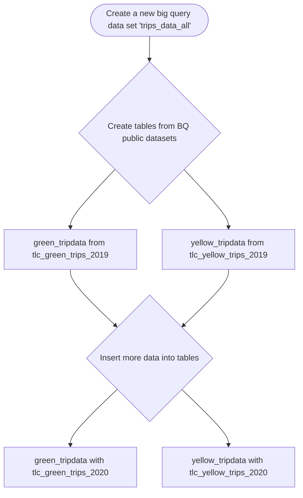
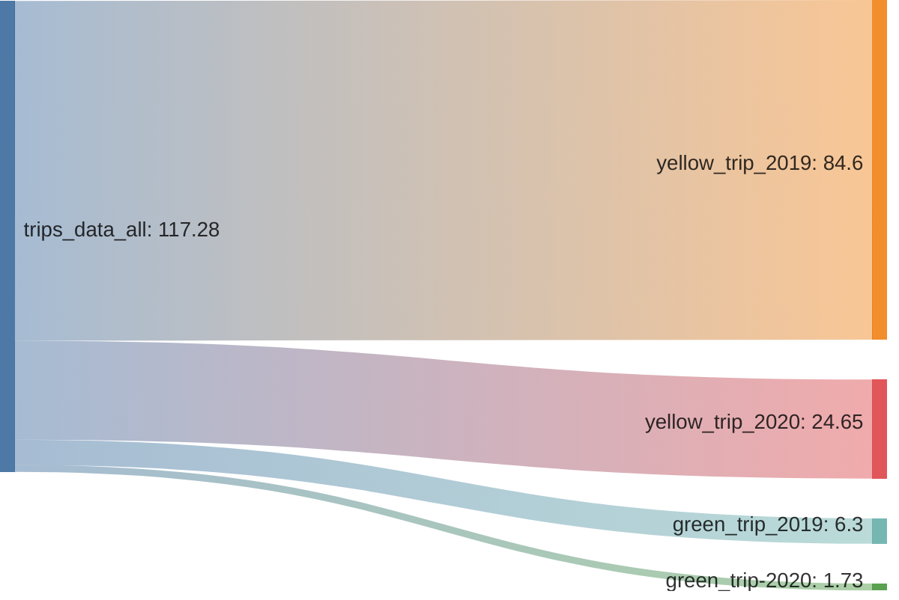
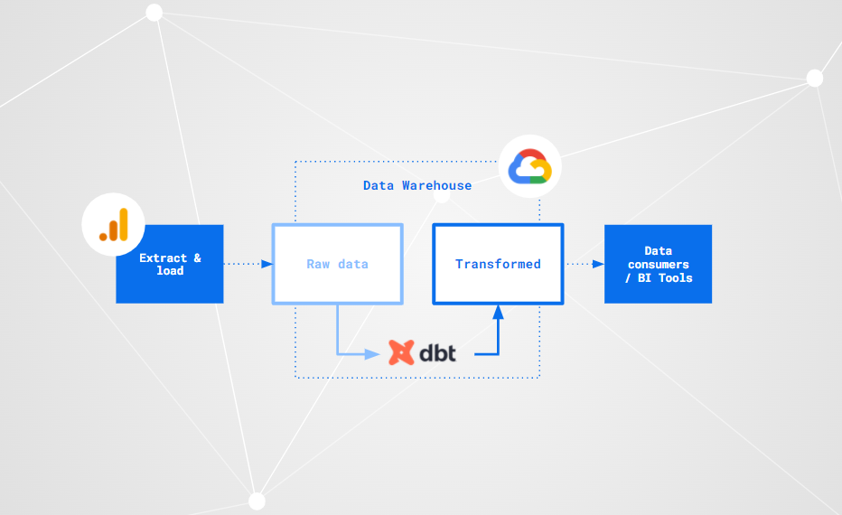

# Module 4: Analytics Engineering

## Setup

### 1) Merging Datasets from public data in Big Query

#### An overview of the data (in millions)

### 2) Setting up dbt for using BigQuery (cloud)

Steps

1) create service account
1) give appropriate bq permissions
1) generate key for service account
1) create dbt account
1) make new project
1) set connection to BigQuery
1) upload key for gcp service account
1) setup repository (Git Clone from Personal Repo (ssh))
1) Add deploy key from DBT to GitHub Repo & Allow write access
1) View you Projects in DBT cloud

