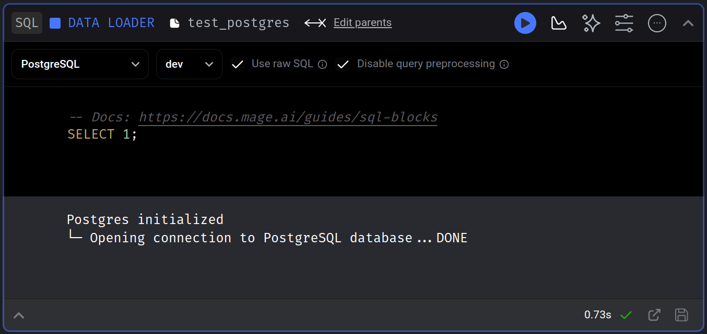
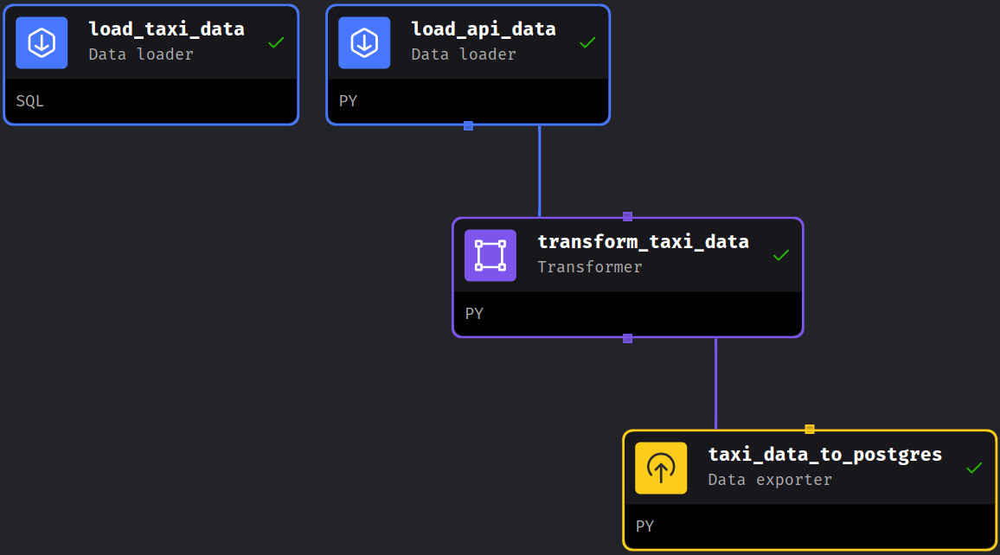

# Claytor's Log

## Module 1: Introduction & Prerequisites

### 1A: Docker + Postgres

#### 12/20/2023 - Setup

- Set-up GCP account through CLI and made a new project in Google cloud.
- Installed Docker and Docker Compose.
- Prepared a working environment for the course
- Successfuly created a few trial containers.
  - Made Dockerfile
    - Runs python 3.1
    - Installs Pandas
    - ENTRYPOINT at 'python', 'pipeline.py'
  - Created pipeline (pipeline.py)
    - imports sys and pandas
- Successfully built and tested a container that takes an argument and gives an expected result! 😂
- Basic workflow notes
  - Pull docker image: `docker pull 'name_of_container'`
  - Build container: `docker build -t 'name_of_container' .`
  - Run docker `docker run -it 'name_of_container'`

#### 12/21/2023 - Ingestion configuration

- Worked on ingesting data into docker file
- Struggled with port configuration.  Couldn't get my data to where it needed to be.  The issue was that my local installation of pgAdmin was already running on the default port.  I had to I'll handle it tomorrow

#### 12/22/2023 - First attempt at Docker Network

- Was able to successfully create postgres container.
- Explored container with pgcli
- Used sqlalchemy inside of a jupyter notebook to successfuly ingest data to postgres container.  Verified results with pgcli

#### 12/23/2023 - Lots of progress and hard lessons learned

- Created pgAdmin container and accessed it through localhost
- Attempted to setup docker network for both pgadmin and postgres. Kept running into issues
  - Found the source of the errors was from white space in code being run in terminal
  - ⚠️ **CHECK YOUR BASH COMMANDS IN EDITOR FOR WHITESPACE BEFORE PASTING INTO TERMINAL** 😤
- accidentally deleted postgres container with ingested data  🥴.  Didn't take too long to recreate, but it would have sucked if that happened with a larger database.  Not too much trouble to run the notebook again.  Since I'm using parquet files, It makes me kind of nervous not to be able to see the progress from within the notebook . . . I'll probably need a better monitoring strategy in the future.
  - ⚠️ **MAKE SURE YOU SHUT YOUR CONTAINERS DOWN PROPERLY OR SUFFER THE CONSEQUENCES!!!**
- I was able to get the containers networkd and talking together.  I'm so stoked I figured it out!
- Converted ipynb to python script using `jupyter nbconvert` to make a 'poboy' ingestion script.
  - Used argparse library to parse arguments to containers
  - This is referred to as a **top-level code environment**  and required a main block `if __name__ == '__main__':`.  I dont exactly know the broader context of why its needed here, but the instructor said it was needed for things we want to run as scripts.
- Dropped taxi data from container to test script
- I was running the script bind and it was erroring out.  Went down a rabbit hole for error handling.
- OMG IT WORKED!!!!!  I successfully ingested data to my containers with a python script!  It ain't much, but its mine!

#### **12/27/2023** - Making an ingestion container to apply ingestion script to docker network

- Fixed python script do download data to the intended local directory
- Continued to run into confusion about local network vs. docker network.  I got it ironed out.
- I was able to create a container that:
  - connected to docker network containing postgres and pgadmin container
  - installed dependencies to run python ingestion script
  - programatically downloaded local parque file and ingested data to networked postgress database.
  - confirmed success with pgAdmin container.
- started working on docker-compose.yml file to spin up containers programatically.
- YAY!!! docker compose works!

#### **12/28/2023** - Adding another table to postgres container and practicing SQL skills

- Created jupyter notebook to inspect and ingest NY taxi zone information to postgres container
- Practiced some basic queries on database.

### 1B: Docker and SQL

--------------------

#### **12/29/2023** - Introduction to Terraform Concepts & PCP Pre-Requisites

- Began setting up teraform with GCP
- Created a service account and generated keys
- Authenticated application credentials with SKD using OAUTH
- IAM enabled
  - view
  - storage Object Admin
  - Storage Admin
  - Big Query Admin
- Enabled IAM Service Account Credentials API
- Installed Terraform
  - ⚠️ **BE VERY SURE OF WHAT YOU'RE DEPLOYING BEFORE YOU DEPLOY IT 🔥💲🔥**
- Created terraform directory and required files
  - .terraform-version
    - specifies what version of terraform to use
  - main.tf
    - defines configuration of resources
  - README.md
  - variables.tf
    - stores the variables that get used in the main.tf
    - these are passed at runtime 

#### **01/02/2024** - Creating GCP Infrastructure: Initializing configuration and importing plugins

-Started to work with terraform files.

#### **01/03/2024**

- Edited main.tf and variables.tf to work in concert. 
- Created and then destroyed bucket on gcp.  Great success!
  - terraform init
  - terraform plan
  - terraform apply
  - terraform destroy
- Made sure to add appropriate entries for .gitignore

#### **01/15/2024** - Created Ubuntu VM on GCP and Configured

- Generated ssh keys and imported public key to GCP admin.
- SSH into vm and ran htop to confirm machine was working!
- Used vim for editing readme because I'm a glutton for punishment.
- Installed anaconda on vm
- Installed docker on vm
- created ssh config file to ssh into vm locally
- Installed SSH extension for vscode
- Added user to docker group on vm to run without root
- Downloaded docker compose, made executable, and added to path variable
	- `chmod +x docker-compose`
	-  

#### **01/17/2024** - Finished setting up Cloud Environment

- generated ssh keys for github and cloned personal repo to vm
- installed devcontainer for class repo
- forwarded ports for jupyter and pgadmin
- installed terraform binary from website (wget, unzip, rm)
- transferred local gcp credentials to VM in .gcp directory using sftp and  put 
- set GOOGLE_APPLICATION_CREDENTIALS environmental variable
- Activated service account credentials
- Tested terraform (plan/apply) on vm.
- Setup global user name and email on gitconfig
- Pushed changes to github from vm.
- NOTE: There is still a little wonkyness with port forwarding.  I'll need to iron that out later.

#### **01/24/2024** - Repeats

- Successfully modified all previously created code to run natively in my container.

#### **01/28/2024** - The reconing

- Finished and submitted my assessment for the first module.

## Module 2: Workflow Orchestration

#### **01/29/2024** - Introduction to Mage 

##### Notes on orchestration
- Mage and postgres will run in a docker image
- Archetecture
  - Extract 
    - Pull data from a source (API-NYC taxi data set)
  - Transform
    - Data cleaning, transformation, and partitioning.
  - Load
    - API to Mage, Mage to Postgres, GCS, BigQuery
- Orchestraton is the process of dependency management facilitated through automation.  The idea is to minimize manual work.  A good idea is to minimize as much work as possible.
  - The data orchestrator manages scheduling, triggering, monitoring, and resource allocation.
  - Every workflow requires sequential steps.  Porly sequenced transformations mess up your data

##### Notes on Mage

- Mage is an open-source ETL tool
  - projects
  - pipelines
  - blocks (sensors, conditionals, dynamics, webhooks, etc)
    - load
    - transform
    - export
  - Engineering best practices
    - In-line testing and debugging
    - Fully-features observability
      - transfomations in one place
    - DRY principles (Don't Repeat Yourself)
- Core components of Mage
  - Projects
    - Pipelines (Called dags on other products)
      - Blocks (Bits of code that are run in your pipelines)
- Anatomy of a block
  - Imports
  - Decorator
  - Function (must return a dataframe)
  - Assertion

##### Setting up mage for the course

- Pulled repo
- Ran 
```bash 
cp dev.env .env
```
  - moves the dev environment to the .env to keep you from pushing secrets.
```bash
docker-compose up
```
to download the container in the exercise
- Stink!  I ran out of space on my vm.  Need to shut it down and give it more space.
- Okay, I'm back up. Gave myself 100 gb
- Woohoo!  Ran first pipeline in Mage!  Now I need to make my own!

#### **01/29/2024** - Making My First Pipeline in Mage 

- Edited `io_confit.yml` to add dev provile to inject local .env variables into docker container.  You can do this both in vscode and in mage.  The injection uses Jinga Templating
```yml
 # Development pipeline
 dev:
  POSTGRES_CONNECT_TIMEOUT: 10
  POSTGRES_DBNAME: "{{ env_var('POSTGRES_DBNAME') }}"
  POSTGRES_SCHEMA: "{{ env_var('POSTGRES_SCHEMA') }}"
  POSTGRES_USER: "{{ env_var('POSTGRES_USER') }}"
  POSTGRES_PASSWORD: "{{ env_var('POSTGRES_PASSWORD') }}"
  POSTGRES_HOST: "{{ env_var('POSTGRES_HOST') }}"
  POSTGRES_PORT: "{{ env_var('POSTGRES_PORT') }}"
```
- Added a data loader to pipeline to test postgres connection.  Great success


#### **01/31/2024** - Slightly more advanced pipeline.
Worked on a new pipeline that pulls data, performs a light transformation, and writes it postgres
- Extract - Data Loader `load_api_data`
  - Created function to download taxi data and change the dtypes of the columns.
    - We need to map out the datatypes for pandas when loading .csv
    - we need to return the data as csv because that's how you pass frames between blocks in Mage
- Transform - Data Transformation Block `transform_taxi_data`
  - There is some wonkyness in the data (such that there are trips with 0 passengers)
  - We handle this with some pre-proccessing with a transformer.  
  - Added a `@test` decorator
- Load - Data Exporter block (python, postgres) 'taxi_data_to_postgres'
  - Takes data from last cell, opens connection to postgres, exports data to the indicated schema and drops it in.

WOOHOO, My first "local" ETL Pipeline!



#### **02/01/24** Mage to GCP

Watched videos

#### **02/02/24** Configureing GCP with Mage

***SIDE Quiest: I made a bash script to*** 
  - start vm
  - pass the IP to my config file
  - mount a remote directory on my local machine
  - shutting down the vm when i'm finished working

``` bash
🚀 Starting VM [VM_NAME]...
Starting instance(s) [VM_NAME]...done.
Updated [https://compute.googleapis.com/compute/v1/projects/[PROJECT_ID]/zones/[ZONE]/instances/[VM_NAME]].
Instance internal IP is [INTERNAL_IP]
Instance external IP is [EXTERNAL_IP]
🔍 Fetching VM's IP address...
✅ VM IP address is [EXTERNAL_IP]
⏳ Waiting for VM to start and SSH to become ready...
🔄 Waiting for VM SSH to become ready...
🔄 Waiting for VM SSH to become ready...
🔄 Waiting for VM SSH to become ready...
🔄 Waiting for VM SSH to become ready...
VM is ready
📝 Updating existing SSH config for [ALIAS]...
📁 Mounting remote directory...
✅ Successfully mounted [REMOTE_DIR] to [LOCAL_DIR]
🛑 Do you want to shut down the VM? (y/n)
```
1) **Create GCP Bucket**
  - Go to google cloud storage
  - Create a bucket `claytor-mage`
  - Make sure "Enforce public access prevention on this bucket" is enabled
2) **Create Service Account for `claytor-mage**`
  - I set access to owner.  Its very permissive.  Would need to be more limiting in the future.
  - Download key as json
  - Copy it into the Mage project
3) **Create Service Volume**
  - created a volume `claytor-mage`
**4) Authentication**
  - Edit `io_config.yaml` to add gcp credentials
  - Delete all but these lines undder `google`
  
  ```yaml
  GOOGLE_SERVICE_ACC_KEY_FILEPATH: "/path/to/your/service/account/key.json"
  GOOGLE_LOCATION: US # Optional
  ```
5) **Big Query**
- Manually Added titanic_clean.csv to my bucket.

6) **Pipeline** `big_query_test`
- Create a pipeline in Mage with a sql data loader pointed at BigQuery.
- Include a simple sql query to test the connection

6) **Upload to GCP**
- Edit pipeline (`big_query_test`) to remove test sql data loader block
- Make new python Data Loader